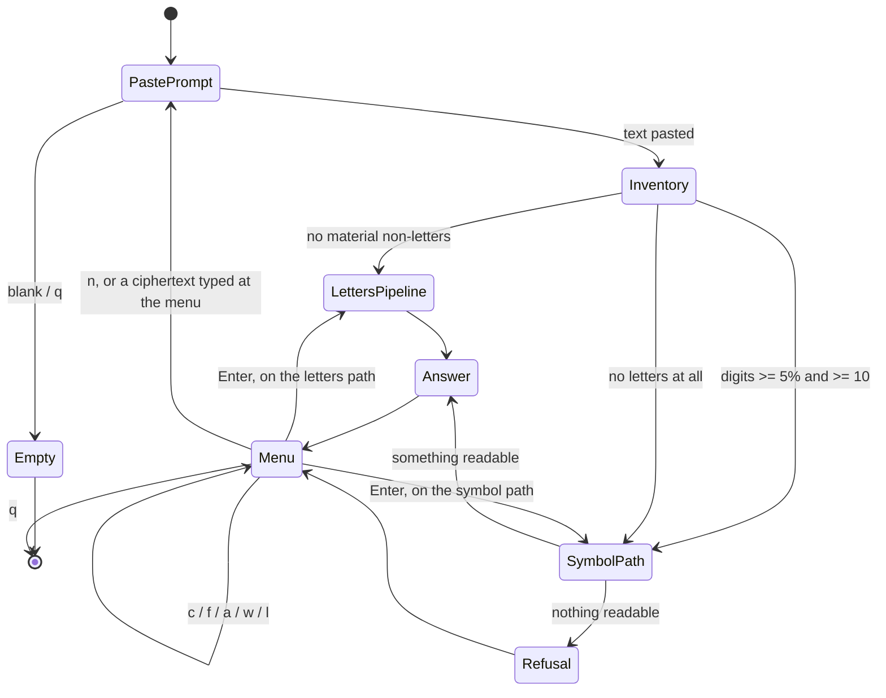

# App Flow -- the paste screen, when the message is not letters

**Date:** 2026-08-18 | **PRD:** `docs/PRD_symbol_stream_honesty.md` | **TDD:** `docs/TDD_symbol_stream_honesty.md`

The only UI in this toolkit is a terminal. "Screen" below means one block of
printed output followed by a prompt.

## Entry points

* `cipher_tool paste` (and the double-click launchers `cipher_tool.bat` /
  `.sh` / `.command`, which run it).
* `[n] new message` from the answer menu.
* A ciphertext typed at the answer menu, which `_looks_like_a_pasted_message`
  catches and re-enters as a new message.
* `cipher_tool auto <file>` reaches the same analysis but keeps the expert
  report; it caps confidence and prints the structure block, and never refuses.

## The happy path (unchanged for a letters-only cipher)

1. Banner, then the paste prompt.
2. The user pastes any layout and presses Enter on a blank line.
3. **New wording:** `Read 891 symbols: 891 letters. Working...`
   (today: `Read 891 letters. Working...`)
4. The effort ladder climbs itself, fast -> normal -> deep, exactly as today.
5. `BEST ANSWER`, the plaintext, the evidence, the caveat.
6. The answer menu: `[c] [f] [Enter] [a] [w] [s] [n] [q]`.

## The new path (non-letters are a material part of the paste)

1. Paste, as above.
2. `Read 1251 symbols: 891 letters and 360 digits. Working...`
   The inventory describes what was PASTED, never what survived.
3. The symbol-capable path runs: encodings, Polybius with an unknown square,
   and the homophonic family -- at unit size 2 when the paired recogniser saw
   clean alternation. **The letters-only pipeline is not run as though the
   digits were absent, and the effort ladder does not climb by itself here.**
4a. Something readable comes back -> `BEST ANSWER` and the ordinary menu.
4b. Nothing does -> the refusal screen, which names what was recognised:
    two disjoint alternating classes, 13 ranks x 4 suits, a 52-card deck,
    every pair of symbols one card, where alternation breaks, and that the
    key was not recovered. Then the menu, with `[l]` added.

## Every state of every screen

| Screen | Loading | Empty | Populated | Error | "Unauthorised" | Offline / slow |
|---|---|---|---|---|---|---|
| Paste prompt | n/a -- the prompt is the first thing printed | Blank line before any text is ignored ("leading blank lines are just the user pressing Enter"); `q` on the first line exits | The pasted block | Ctrl-C / EOF returns 0 quietly | n/a -- no accounts, nothing to authorise | n/a |
| Inventory line | `Working...` follows on the same line | `No letters were pasted, so there is nothing to work on` (only for a genuinely empty paste) | `Read N symbols: A letters and B digits.` | n/a | n/a | Printed before any search starts, so the user always sees the count within a second |
| Answer | `That did not score as clear English. Searching harder (normal)...` between rungs | `NO ANSWER FOUND` -- nothing was produced at all | `BEST ANSWER (...)` with plaintext, cipher, key, confidence, caveat | A solver that raises is reported as a stage note, never a traceback | n/a | Deep can take minutes; each rung announces itself before it starts |
| Refusal (new) | n/a -- printed after the symbol path finishes | n/a | The recognised structure, the break index, "the toolkit could not recover the key", and the commands that can work on it | If the recogniser detects nothing, the refusal says only what is true: digits are a material part of the paste, no structure was recognised, and it names `analyse` and `encodings` | n/a | The symbol path is bounded by the homophonic stage's gates and time budget |
| Answer menu | n/a | `There is no answer to copy` / `to save` when there is none | The key list, with `[l]` present only on the refusal path | `Could not write plaintext.txt: <reason>`; a mistyped key is named back, never silently obeyed | n/a | `[Enter]` re-runs at the next effort and says so first |

* **Empty** is two different things and they must stay different: "nothing was
  pasted" and "what was pasted has no letters in it". The first gets today's
  wording; the second gets the symbol path. Conflating them is bug (1) of this
  family and it is not to be reintroduced.
* **Error** never shows a traceback: `main()` catches `InputError`, the stage
  loop catches every solver exception into a stage note, and `_error_message`
  strips the exception class name.
* **Unauthorised** does not exist here, and saying so is the honest answer:
  no server, no accounts, no revocation path.
* **Offline / slow**: the tool is offline by design and by competition rule. The
  slow case is a deep search, which is announced before it starts and which the
  new path deliberately does not enter on its own.

## Transitions

## Permissions per state

None. Every state is reachable by anyone who can run the program, nothing is
gated, nothing is revocable, and no state depends on identity. Recorded so the
absence is deliberate rather than unexamined.

## Dead ends

There must be none, and this feature exists because there were two.

* `No letters were pasted, so there is nothing to work on. Run it again` on a
  numeric ciphertext -- the one reply that guarantees an identical retry.
  Already fixed; the tests that hold it fixed must keep passing.
* A confident wrong answer is a dead end of a worse kind: the user stops. The
  refusal screen replaces it and must always end with somewhere to go --
  `homophonic`, `analyse`, `[l]`, or `[s]` for the shell and a crib.
* The refusal screen itself must never be the last word without a next step. If
  the recogniser found nothing, it says so and still names `analyse`.

## Accessibility

* Keyboard only; there is nothing else. Every menu action is one key plus Enter.
* Colour is never used, so it is never the only signal. Emphasis is words and
  rules of `=` and `-`, which a screen reader announces as punctuation and which
  a braille display renders unambiguously.
* The plaintext is printed flush left with no decoration so that select-all-copy
  takes the answer and nothing else; the refusal screen prints no plaintext at
  all, so there is nothing there to copy by accident.
* Line length stays within 72 characters, as the rest of the screen does.
* Pure ASCII output, so no terminal code page can turn a character into a
  crash -- the same reason `strip_bom` exists.
